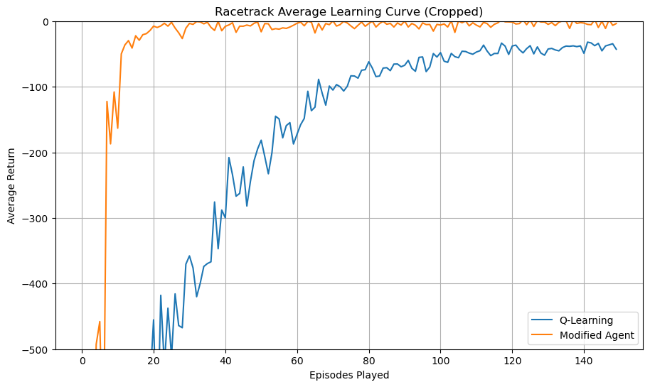

# Double Q-Learning with Prioritised Experience Replay on Racetrack Environment

## Overview
This project presents my implementation of the Double Q-Learning algorithm with prioritised experience replay, epsilon decay and adaptive learning rate. It is a practical assignment from a Reinforcement Learning course (University of Bath) aimed at implementing a Temporal Difference (TD) RL algorithm with better performance than calssic Q-Learning, 

## Features
- **Double Q-Learning Algorithm**: Implementation of the Double Q-Learning algorithm to mitigate overestimation bias inherent in traditional Q-Learning.
- **Prioritised Experience Replay**: Inclusion of a prioritised experience replay mechanism, allowing the agent to learn more effectively from important past experiences.
- **Epsilon Decay**: Integration of an epsilon decay strategy to balance exploration and exploitation throughout the training process.
- **Adaptive Learning Rate**: Application of an adaptive learning rate that adjusts as learning progresses, ensuring more stable convergence.
- **Performance Analysis**: Comprehensive analysis of the agent's learning journey, including exploration rates, learning rate adjustments, and reward accumulation.

The environment was provided by the lecturer as a part of the assignment. 
## Results
#### The Comparison of My Algorithm with Classic Q-Learning

