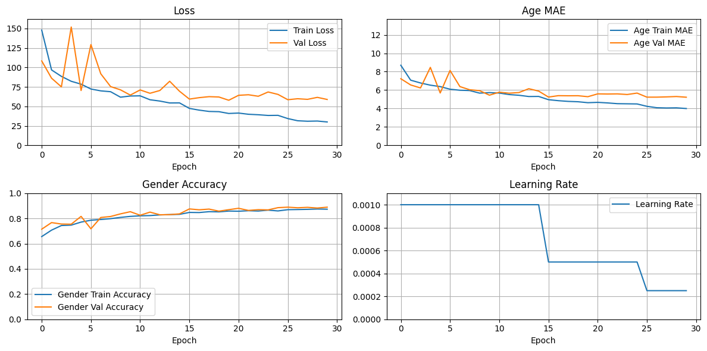

# Age and Gender Prediction Using InceptionV3 in Keras

This project demonstrates an implementation of the InceptionV3 architecture for predicting age and gender from facial images. The model is applied to the [UTKFace dataset](https://www.kaggle.com/jangedoo/utkface-new) of facial images with corresponding age and gender labels.

## Overview

- **Model:** InceptionV3 implemented in Keras with custom layers for age and gender prediction
- **Dataset:** [UTKFace dataset](https://www.kaggle.com/jangedoo/utkface-new)
- **Objective:** Predict age and gender from facial images

## Highlights

- The model uses fine-tuned InceptionV3 architecture. 
- Applied data augmentation techniques and fine-tuned hyperparameters.
- Achieved strong performance on the dataset with separate evaluation metrics for age and gender prediction.

## Results

Test Loss: 51.91027069091797
Test Age MAE: 5.030325412750244
Test Gender Accuracy: 0.8544917702674866

